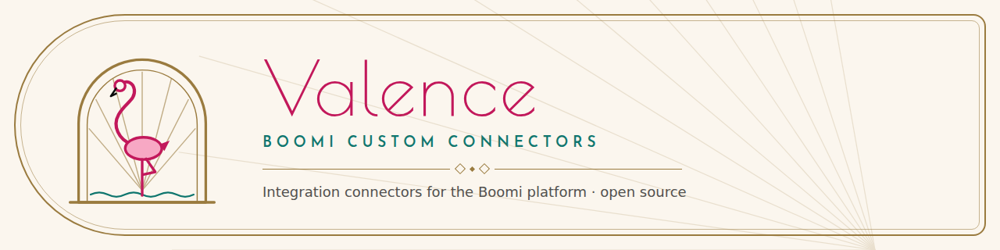

<picture>
  <source media="(prefers-color-scheme: dark)" srcset="brand/assets/banner-night.png">
  
</picture>

# BoomiCustomConnectors
An open source repository for custom connector assignments

**Docs site:** [brianbrinley.github.io/BoomiCustomConnectors](https://brianbrinley.github.io/BoomiCustomConnectors/). The same docs in the Valence theme, with Day/Night mode and the latest connector downloads.

## Connectors

| Connector | Description |
|---|---|
| [jev-connector](jev-connector/) | Sends text documents to the JEV decision API and returns structured, confidence-gated results |

## Theme

Everything in this repo uses the **Valence — Miami Deco** theme: diagrams, docs and any generated pages. Palette, type, CSS variables and the Mermaid diagram theme are in [`brand/`](brand/). The docs site is built from these READMEs by [`site/`](site/).
