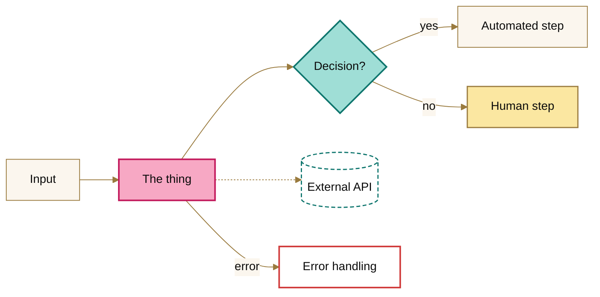

# Valence — Miami Deco theme

The default visual theme for every project in this repository: diagrams, docs, generated pages and UI. The source design is the [Valence Brand Concept — Miami Deco](https://claude.ai/artifact/D26fRmpXzXtYfehDs44FLo) canvas. When the brand changes there, update this folder.

| File | Use it for |
|---|---|
| [`tokens.json`](tokens.json) | Canonical values: palettes, status colors, type. Everything else derives from it |
| [`valence.css`](valence.css) | HTML pages and UI: CSS variables for Miami Day, plus Miami Night under `prefers-color-scheme: dark` / `data-theme="dark"` |
| [`mermaid-init.txt`](mermaid-init.txt) | First line of every Mermaid diagram |
| [`mermaid-classes.txt`](mermaid-classes.txt) | Node styles to paste at the end of a flowchart |

## Palette

### Miami Day (default, light)

| Swatch | Name | Hex | Use | Text-safe? |
|---|---|---|---|---|
|  | Sand | `#FBF6EE` | Page background | — |
|  | Ink | `#0B0B0B` | Body text, headings | 18.29:1 on Sand |
|  | Flamingo | `#C2185B` | Primary accent: the name, key actions, links on light | 5.72:1 ✔ |
|  | Flamingo Pastel | `#F7A8C4` | Fills, illustration | Fill only |
|  | Ocean Drive Teal | `#0F766E` | Secondary accent: connections, links | 5.33:1 ✔ |
|  | Seafoam | `#9FDED6` | Fills, soft highlights | Fill only |
|  | Sunset Lemon | `#FBE7A1` | Highlights and callouts behind dark text | Fill only |
|  | Deco Gold | `#9A7B3F` | Linework, rules, frames, arrows | 3.88:1, graphics and large text only |

### Miami Night (dark)

Designed for dark, not auto-inverted: neon pastels on midnight navy.

| Name | Hex | Use |
|---|---|---|
| Midnight Navy | `#161A2E` | Background (surfaces `#1F2440`) |
| White / Moonlight | `#FFFFFF` / `#C9CBE0` | Text / secondary text |
| Neon Flamingo | `#F48FB1` | Primary accent (7.80:1) |
| Neon Seafoam | `#5EEAD4` | Secondary accent, links (11.77:1) |
| Sunset Lemon | `#FBE7A1` | Highlights, callouts (14.14:1) |
| Deco Gold | `#D4B46A` | Linework, frames (8.74:1) |

### Status colors: fixed meanings

Healthy `#0CA30C` · Warning `#FAB219` · Serious `#EC835A` · Critical `#D03B3B`. These are the same in both themes.

**Rules:** health is never shown in brand colors, and never by color alone. Every status always carries its icon and label.

## Type

| Role | Font | Notes |
|---|---|---|
| Wordmark and display | **Poiret One** | Wordmark and big display lines only |
| Headings and labels | **Josefin Sans** 400/600/700 | Labels often uppercase with wide letter-spacing |
| Body and data | System UI sans | `system-ui, -apple-system, "Segoe UI", sans-serif` |

Google Fonts: `https://fonts.googleapis.com/css2?family=Poiret+One&family=Josefin+Sans:wght@400;600;700&display=swap`

## Diagrams (Mermaid)

GitHub renders Mermaid natively. To brand a diagram:

1. Make [`mermaid-init.txt`](mermaid-init.txt) the **first line** inside the `mermaid` code block.
2. For flowcharts, paste [`mermaid-classes.txt`](mermaid-classes.txt) at the end and tag nodes with `:::class`.

| Class | Look | Use for |
|---|---|---|
| `focus` | Flamingo Pastel / Flamingo | The thing the diagram is about (e.g. the connector) |
| `decision` | Seafoam / Ocean Drive Teal | Decisions and branches |
| `highlight` | Sunset Lemon / Deco Gold | Human steps, callouts |
| `external` | White / dashed teal | External systems and APIs |
| `error` | White / Critical | Error paths. Always keep the word "error" in the label |
| *(default)* | Sand / Deco Gold | Everything else |

**Sequence diagrams:** wrap the whole interaction in `rect rgb(251, 246, 238)` … `end`. That keeps message text on Sand, so it stays readable when GitHub is in dark mode.



## Repository page

GitHub doesn't allow custom CSS on github.com, so the page chrome can't be themed. What can be:

- **README banners** in [`assets/`](assets/), with Day and Night versions that follow the reader's GitHub theme:
  ```html
  <picture>
    <source media="(prefers-color-scheme: dark)" srcset="brand/assets/banner-night.png">
    
  </picture>
  ```
- **Social preview:** upload [`assets/social-preview.png`](assets/social-preview.png) (1280×640) under **Settings → General → Social preview**. That's the card shown when the repo link is shared.
- **Diagrams:** themed with the Mermaid files above.
- **Docs site:** GitHub Pages, fully themed (fonts, Day/Night toggle, styled tables and code). It's built from the READMEs by [`site/`](../site/); see the root [`CLAUDE.md`](../CLAUDE.md).

The banners were rendered from HTML using the brand fonts, the flamingo mark and the Deco Gold frame, at 1280×320 (banners) and 1280×640 (social preview).
