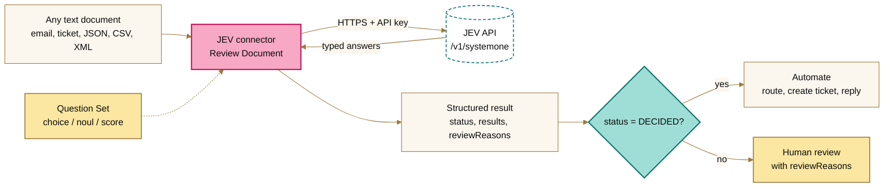
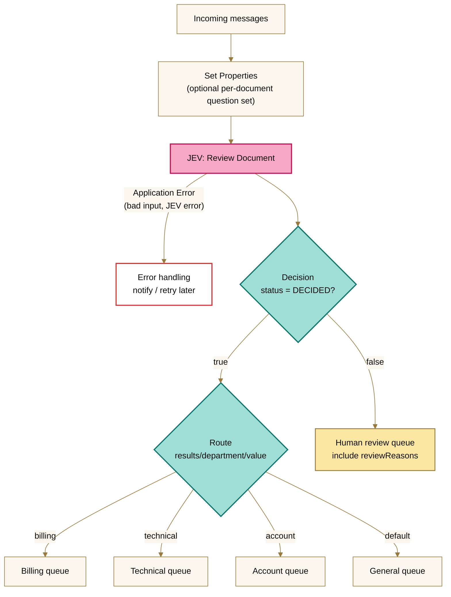
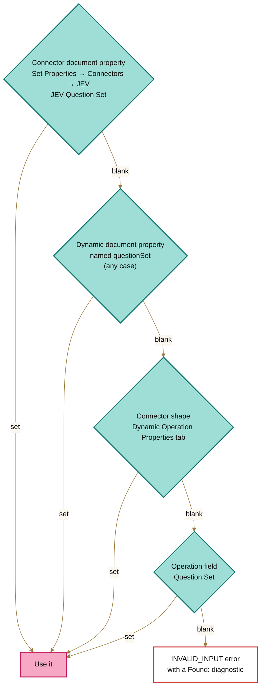
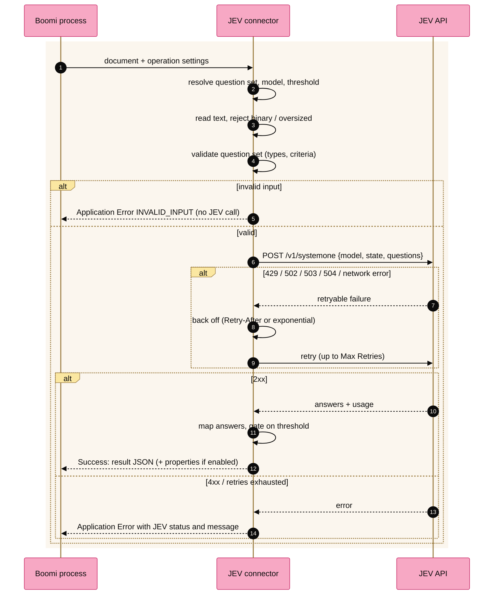

<picture>
  <source media="(prefers-color-scheme: dark)" srcset="../brand/assets/jev-banner-night.png">
  
</picture>

# Boomi JEV Connector

**Docs site:** [JEV Connector](https://brianbrinley.github.io/BoomiCustomConnectors/jev-connector/), with the latest CAR and descriptor downloads.

A Boomi custom connector that sends text-based documents to the [JEV](https://huggingface.co/blog/sora-2/jev-ai-api-tutorial-build-your-first-structured-de) decision API and returns a structured, confidence-gated result for each document.

You describe the decisions you want as a **Question Set**, for example "which team?", "does a human need to look at this?" and "how urgent?". The connector handles auth, request building, retries, response parsing and confidence gating. Your Boomi process only has to route on the answers.



**Contents:**
[Quick start](#quick-start) ·
[Build](#build) ·
[Deploy and upgrade](#deploy-and-upgrade-in-boomi) ·
[Connection](#connection-fields) ·
[Operation](#operation-review-document) ·
[Question sets](#writing-a-question-set) ·
[Output](#output-document) ·
[Using results in a process](#using-results-in-a-process) ·
[Per-document question sets](#per-document-question-sets) ·
[How a request flows](#how-a-request-flows) ·
[Troubleshooting](#troubleshooting)

---

## Quick start

1. **Get the files.** Download `jev-connector-car` from the latest green run under **Actions → JEV Connector**, or build locally (see [Build](#build)).
2. **Upload** the CAR and `connector-descriptor.xml` to a Boomi connector group.
3. **Create a connection** with your JEV Base URL and API key, then click **Test Connection**.
4. **Create a Review Document operation.** Paste the [support triage question set](#example-1-support-triage) and click **Import**.
5. **Run a test process:** Start → Message (`Help! My payouts have been failing for 3 days.`) → JEV → Stop. The output looks like the [example result](#output-document).

---

## Build

Requirements: JDK 11+ and Maven 3.6+. The Boomi SDK comes from `https://boomisdk.s3.amazonaws.com/releases`, which is already declared in the POM.

```bash
cd jev-connector
mvn clean verify
```

| Output | Upload it as |
|---|---|
| `target/jev-connector-<version>-car.zip` | The connector **archive** |
| `src/main/resources/connector-descriptor.xml` | The connector **descriptor** (also inside the CAR under `META-INF/`) |

The bytecode targets Java 11, so it runs on any current Boomi runtime.

### Build on GitHub (no local setup)

`.github/workflows/jev-connector.yml` builds and tests on every push or PR that touches `jev-connector/`. You can also start it by hand from **Actions → JEV Connector → Run workflow**.

- **Download:** open the run → **Artifacts** → `jev-connector-car` (contains the CAR and the descriptor).
- **Release:** push a tag such as `jev-connector-v1.1.0`; the same files are attached to a GitHub Release.

---

## Deploy and upgrade in Boomi

**First install**
1. **Settings → Account Information and Setup → Publisher:** fill in publisher details (one time).
2. **Developer → Connector Groups → Add:** upload the CAR and the descriptor, and name the connector, e.g. *JEV*.
3. Custom connectors run on your own runtime (local Atom, Molecule or private cloud).

**Upgrading to a new version**

```mermaid
%%{init: {"theme": "base", "fontFamily": "Josefin Sans, trebuchet ms, verdana, arial, sans-serif", "themeVariables": {"fontSize": "15px", "background": "#FBF6EE", "primaryColor": "#FBF6EE", "primaryTextColor": "#0B0B0B", "primaryBorderColor": "#9A7B3F", "lineColor": "#9A7B3F", "textColor": "#0B0B0B", "secondaryColor": "#9FDED6", "tertiaryColor": "#FBE7A1", "edgeLabelBackground": "#FBF6EE", "clusterBkg": "#FBF6EE", "clusterBorder": "#9A7B3F", "actorBkg": "#F7A8C4", "actorBorder": "#C2185B", "actorTextColor": "#0B0B0B", "actorLineColor": "#9A7B3F", "signalColor": "#0B0B0B", "signalTextColor": "#0B0B0B", "labelBoxBkgColor": "#FBE7A1", "labelBoxBorderColor": "#9A7B3F", "labelTextColor": "#0B0B0B", "loopTextColor": "#0B0B0B", "noteBkgColor": "#FBE7A1", "noteBorderColor": "#9A7B3F", "noteTextColor": "#0B0B0B", "activationBkgColor": "#9FDED6", "activationBorderColor": "#0F766E", "sequenceNumberColor": "#FBF6EE"}}}%%
flowchart LR
    A["Bump version in pom.xml<br/>and build"] --> B["Add a new connector version:<br/>upload BOTH the CAR and the descriptor"]
    B --> C["Point the process at<br/>the new version"]
    C --> D["Re-open the operation<br/>and click Import"]
    D --> E["Test run"]
    class B focus
    classDef focus fill:#F7A8C4,stroke:#C2185B,stroke-width:2px,color:#0B0B0B
    classDef decision fill:#9FDED6,stroke:#0F766E,stroke-width:2px,color:#0B0B0B
    classDef highlight fill:#FBE7A1,stroke:#9A7B3F,stroke-width:1.5px,color:#0B0B0B
    classDef external fill:#FFFFFF,stroke:#0F766E,stroke-width:1.5px,stroke-dasharray:5 3,color:#0B0B0B
    classDef error fill:#FFFFFF,stroke:#D03B3B,stroke-width:2px,color:#0B0B0B
```



- **Always upload both files.** New fields and properties live in the descriptor.
- **If a test run behaves like the old version, the process is still on it.** Check which connector version the connection and operation use.
- **Re-import after upgrading** so the response profile picks up new fields.

---

## Connection fields

These are ordinary connection fields, so each environment can have its own values through **Environment Extensions**.

| Field | Default | Notes |
|---|---|---|
| Base URL | `https://api.typesafe.ai` | Your JEV host |
| Decision Endpoint Path | `/v1/systemone` | |
| API Key | — | Password field, never logged |
| Auth Header Name | `Authorization` | |
| Auth Scheme | `Bearer` | Blank sends the raw key |
| Default Model | `jev-latest` | |
| Connect / Read Timeout (ms) | 10000 / 60000 | |
| Max Retries | 2 | Retries 429/502/503/504 and network errors; honours `Retry-After` |

**Test Connection** sends a one-question request to check the URL, key and model. A wrong key shows JEV's status and message, e.g. `401 invalid api key`.

---

## Operation: Review Document

| Field | Default | Purpose |
|---|---|---|
| Request Mode | Document Review | *Document Review*: the document becomes JEV `state` and the Question Set is attached. *Raw Request*: the document already is a full JEV request |
| Question Set (JSON) | — | The decisions to make (see [Writing a question set](#writing-a-question-set)). Can be [set per document](#per-document-question-sets) |
| Model | *(connection default)* | Can be set per document |
| Document Format | Auto-detect | *Auto*: JSON is sent as JSON, anything else as text. *JSON*: must be valid JSON. *Text*: always a string |
| State Wrapper Key | *(none)* | Wraps the document as `{"<key>": document}` |
| Confidence Threshold | `0.8` | Any answer below it makes the document `NEEDS_REVIEW`. Blank disables gating. Can be set per document |
| Include Raw JEV Response | false | Adds JEV's unmodified response under `raw`. Handy while testing |
| Max Document Size (KB) | 1024 | Larger documents are rejected before calling JEV |
| Max Concurrent Requests | 1 | How many JEV requests may be in flight at once (1–16). See [Throughput](#throughput) |
| **Set Document Properties** | false | Feature flag: adds the result as [dynamic document properties](#option-b-dynamic-document-properties-no-profile-needed) |
| **Keep Original Document** | false | Feature flag (needs the one above): keeps the input text in `jevOriginalDocument` |
| **Set Tracked Properties** | false | Feature flag: records the result in [Process Reporting](#option-c-tracked-properties-process-reporting) |

Binary input (NUL bytes or invalid UTF-8) is rejected before any JEV call.

### Throughput

Every document is one JEV request. **Max Concurrent Requests** sets how many of those requests run at the same time when several documents reach the shape together.

| Value | Behaviour | Use it for |
|---|---|---|
| `1` (default) | One request after another, on the process thread. No worker threads are created | Listener and API processes, and anything that handles one document at a time |
| `2`–`16` | Documents are taken in groups of this size and each group's requests run in parallel | Batches, such as a scheduled process reviewing a few hundred documents |

What stays the same at any value:
- Every input document still produces exactly one result, and results come back in the order the documents arrived.
- One failed request is one Application Error. It never fails the rest of the group.
- Only one group of documents is held in memory at a time.

What changes above 1:
- **Rate limits are shared.** When JEV answers one request with `429`, the other workers wait out the same back-off before sending their next request.
- **Values above 16 are treated as 16.**
- **If the runtime does not allow worker threads**, the connector logs a warning on the document and sends requests one at a time. Nothing fails.

A single document never uses a worker thread, so a higher value costs nothing in processes that usually receive one document. Start low (4 is a reasonable first value) and raise it only while `429`s stay rare.

---

## Writing a question set

A question set is a JSON object. Each key is a **question ID** you choose; it becomes the field name in the output, e.g. `results.department`.

| Type | Asks | `criteria` | Answer `value` |
|---|---|---|---|
| `choice` | "Which one?" | **Object** of option ID → description | The chosen option ID, e.g. `"billing"` |
| `noul` | "Yes or no?" | none | `true` / `false` (plus `probability`) |
| `score` | "How much?" | **Array** of 2–10 levels, lowest first | Probability-weighted level index, e.g. `1.6`, plus `level` (the most likely level's text) |

Tips:
- JEV reads the descriptions before deciding, so write them the way you would brief a new hire.
- Option IDs are what you route on, so keep them short and stable (`billing`, not `Billing Team (EMEA)`).
- Each question adds tokens, so only ask what you'll act on.
- The connector checks these rules before calling JEV and reports problems as `INVALID_INPUT`.

### Example 1: support triage

Input: `Help! My payouts have been failing for 3 days.`

```json
{
  "department": {
    "type": "choice",
    "instructions": "Which team should handle this customer message?",
    "criteria": {
      "billing": "Payments, payouts, invoices, refunds or charges",
      "technical": "Bugs, outages, errors or integration problems",
      "account": "Login, access, profile or account settings",
      "sales": "Pricing, upgrades, plans or new accounts"
    }
  },
  "needs_human": {
    "type": "noul",
    "instructions": "Does this message need a human agent rather than an automated reply?"
  },
  "urgency": {
    "type": "score",
    "instructions": "How urgent is this customer's issue?",
    "criteria": [
      "Can wait a week or more; general question",
      "Should be handled within a day or two",
      "Needs attention today; money or service is blocked"
    ]
  },
  "frustration": {
    "type": "score",
    "instructions": "How frustrated is the customer?",
    "criteria": ["Calm, just stating facts", "Frustrated but civil", "Very angry or threatening to leave"]
  }
}
```

The [output document](#output-document) shows the real result for this input.

### Example 2: invoice review

Input: an invoice as JSON or text (vendor, lines, totals, notes).

```json
{
  "invoice_type": {
    "type": "choice",
    "instructions": "What kind of invoice is this?",
    "criteria": {
      "goods": "Physical products or materials",
      "services": "Labour, consulting or subscriptions",
      "mixed": "Both goods and services",
      "credit_note": "A credit or refund rather than a charge"
    }
  },
  "looks_valid": {
    "type": "noul",
    "instructions": "Does the invoice look complete and internally consistent (totals add up, vendor and dates present)?"
  },
  "risk": {
    "type": "score",
    "instructions": "How risky is it to pay this invoice without a manual check?",
    "criteria": ["Routine and low risk", "Unusual in some way; worth a quick look", "Suspicious or likely wrong; hold for review"]
  }
}
```

Route on `invoice_type`, auto-approve when `status = DECIDED`, `looks_valid = true` and `risk.level` is the first level.

### Example 3: content moderation

Input: a user comment or post.

```json
{
  "allowed": {
    "type": "noul",
    "instructions": "Is this content acceptable under a typical community policy (no harassment, hate, spam or explicit content)?"
  },
  "category": {
    "type": "choice",
    "instructions": "What is the main issue, if any?",
    "criteria": {
      "none": "No policy issue",
      "spam": "Advertising, scams or repeated promotional content",
      "harassment": "Personal attacks, threats or bullying",
      "other": "Another policy issue"
    }
  }
}
```

Publish when `status = DECIDED` and `allowed = true`; queue everything else for a moderator. Use a higher Confidence Threshold (e.g. `0.9`) here, since mistakes are visible.

### Raw Request mode

When the document already is a JEV request (built in a Map, or received from an API), set **Request Mode = Raw Request**. The connector fills in `model` if missing, validates the questions, and maps the result the same way:

```json
{ "state": { "message": "Help! My payouts have been failing for 3 days." },
  "questions": { "needs_human": { "type": "noul", "instructions": "Does this need a human?" } } }
```

---

## Output document

The real result for [Example 1](#example-1-support-triage):

```json
{
  "status": "NEEDS_REVIEW",
  "model": "jev-1.13.0",
  "confidenceThreshold": 0.8,
  "results": {
    "department":  { "type": "choice", "value": "billing", "confidence": 0.99, "passed": true,
                     "probabilities": { "account": 0.0, "technical": 0.01, "sales": 0.0, "billing": 0.99 } },
    "needs_human": { "type": "noul", "value": true, "probability": 0.73, "confidence": 0.73, "passed": false },
    "urgency":     { "type": "score", "value": 2.0, "level": "Needs attention today; money or service is blocked",
                     "confidence": 1.0, "passed": true, "probabilities": { "0": 0.0, "1": 0.0, "2": 1.0 },
                     "legend": { "0": "Can wait a week or more; general question", "1": "Should be handled within a day or two",
                                 "2": "Needs attention today; money or service is blocked" } },
    "frustration": { "type": "score", "value": 1.0, "level": "Frustrated but civil", "confidence": 0.99, "passed": true,
                     "probabilities": { "0": 0.01, "1": 0.99, "2": 0.0 }, "legend": { "...": "..." } }
  },
  "reviewReasons": ["needs_human: confidence 0.7300 below threshold 0.8000"],
  "usage": { "input_tokens": 509, "output_tokens": 93 }
}
```

How to read it:
- **`status`:** `DECIDED` when every answer passed; `NEEDS_REVIEW` when any answer was below the threshold, missing, or had no selected option. `reviewReasons` explains which.
- **`passed`:** whether each answer's `confidence` met the threshold. An answer with no confidence can't be gated and counts as passed.
- **Confidence by type:**
  - **choice:** JEV's `confidence`, falling back to the top probability.
  - **noul:** JEV's `confidence`, falling back to `max(p, 1-p)`. `value` is `probability >= 0.5`.
  - **score:** JEV's `confidence`, falling back to the top level probability.

---

## Using results in a process

There are three ways to act on a result. Use whichever suits each shape.



### Option A: the response profile (recommended for maps)

On the operation, with your question set in place, click **Import**. You get a JSON profile with typed elements such as `results/department/value` and `results/urgency/level`. Use **Profile Element** parameters in shapes:

| Shape | Setting |
|---|---|
| **Decision** | First value: Profile Element → `status` · Equal To · Static `DECIDED` |
| **Decision** | `results/needs_human/value` Equal To `true` → force human handling |
| **Decision** | `results/urgency/value` Greater Than or Equal `1.5` → high-urgency path |
| **Route** | Route By: Profile Element → `results/department/value`; one route per option ID (`billing`, `technical`, …) plus Default |
| **Business Rules** | Several conditions at once, e.g. `department = billing AND urgency >= 1.5 AND needs_human = false` |
| **Map** | Map `results/*/value`, `level` and `reviewReasons` into your target system's profile |

Compare on **option IDs** for choice questions (`billing`) and on `value` (a number) or the exact `level` text for score questions.

### Option B: dynamic document properties (no profile needed)

Use **Document Properties** and every output document carries:

| Property | Example |
|---|---|
| `jevStatus` | `NEEDS_REVIEW` (`ERROR` when JEV rejected the document) |
| `jevModel` | `jev-1.13.0` |
| `jevReviewReasons` | `needs_human: confidence 0.7300 below threshold 0.8000` |
| `jevInputTokens` / `jevOutputTokens` | `509` / `93` |
| `jev_<id>` | `jev_department` = `billing`, `jev_needs_human` = `true`, `jev_urgency` = `2.0` |
| `jev_<id>_confidence` | `jev_department_confidence` = `0.99` |
| `jev_<id>_passed` | `jev_needs_human_passed` = `false` |
| `jev_<id>_level` *(score only)* | `jev_urgency_level` = `Needs attention today; money or service is blocked` |
| `jevErrorCode` *(errors only)* | `422` |
| `jevOriginalDocument` | The input text. Requires **Keep Original Document** |

Use them in Decision/Route shapes (parameter type **Document Property → Dynamic Document Property**), maps, email bodies or notify messages.

**Keep Original Document** solves a common problem: the connector's output *replaces* the input document, so a later Map that needs the original message (e.g. as the ticket description) can read `jevOriginalDocument` instead.

### Option C: tracked properties (Process Reporting)

Use **Tracked Properties** to record these on every document, visible and searchable in **Process Reporting**:

| Tracked property | Example |
|---|---|
| JEV Status | `NEEDS_REVIEW` |
| JEV Model | `jev-1.13.0` |
| JEV Summary | `department=billing; needs_human=true; urgency=Needs attention today; money or service is blocked; frustration=Frustrated but civil` |
| JEV Review Reasons | `needs_human: confidence 0.7300 below threshold 0.8000` |
| JEV Input / Output Tokens | `509` / `93` |

Values longer than 1000 characters are cut off in tracking; the dynamic document properties keep the full text.

---

## Per-document question sets

One process can apply different question sets to different documents, e.g. per customer, channel or language. The connector checks these sources in order, and the first non-blank value wins:



The same order applies to **Model** (`jevModel` / `model`) and **Confidence Threshold** (`jevConfidenceThreshold` / `confidenceThreshold`).

Typical pattern: keep question sets in a **Cross Reference Table** or **Process Property** keyed by channel, and set **JEV Question Set** in a Set Properties shape before the JEV shape.

---

## How a request flows



Every input document produces exactly one result, so one bad document never fails the batch. Turn on **Return Application Error Responses** on the connector shape to route errors yourself instead of failing the process.

---

## Troubleshooting

| You see | Cause | Fix |
|---|---|---|
| `[422] … "loc":["body","questions","<id>","score","criteria"] … Field required` | A score question without `criteria` reached JEV, which means you're on a connector version older than 1.0.1 | Add `criteria` as an array of 2–10 levels, and upgrade the connector |
| `[INVALID_INPUT] Score question '<id>' needs 'criteria' as an array of 2 to 10 level descriptions` | Same problem, caught before calling JEV | Add the `criteria` array |
| `[INVALID_INPUT] Question Set is required … [Found: …]` | No source had a question set | The `Found` section shows what each source held (`not set` / `empty` / `N chars`) and which property names were present. Check the property name and that it's set before the JEV shape |
| Behaviour doesn't match the latest version | The process still uses the old connector version | See [upgrading](#deploy-and-upgrade-in-boomi): upload both files, point the process at the new version |
| New fields missing from the profile | The profile was imported before the change | Re-open the operation and click **Import** |
| `401` / `403` | Wrong API key, header or scheme | Check the connection; use **Test Connection** |
| `429` after retries | Rate limited | Lower **Max Concurrent Requests**, raise **Max Retries**, or reduce the batch size |
| Log says "this runtime did not allow worker threads" | **Max Concurrent Requests** is above 1 on a runtime that blocks thread creation | Nothing is lost: requests run one at a time. Set the field to 1 to silence the warning |
| `CONNECTION_ERROR` | Runtime can't reach JEV | Check Base URL, proxy and firewall from the runtime host |
| Lots of `NEEDS_REVIEW` | Threshold too strict for one question | Lower **Confidence Threshold**, or rewrite that question's instructions and criteria to be clearer |

When testing, turn on **Include Raw JEV Response** to compare JEV's raw answer with the connector's `results`.

---

## Project layout

```
src/main/java/com/boomi/custom/jev/
  JevConnector.java          entry point (connector-config.xml)
  JevConnection.java         connection fields → JevClient
  JevBrowser.java            object type, profile import, Test Connection
  JevReviewOperation.java    EXECUTE operation, one JEV call per document
  client/                    HTTP client, settings, retry, shared rate-limit pause
  concurrent/                windowed parallel calls with sequential fallback
  review/                    document reading, question set validation, request building,
                             result mapping, output schema, per-document config, result properties
src/test/java/...            unit tests + end-to-end tests via the SDK ConnectorTester and an in-process fake JEV server
```

The request and response shapes follow the JEV API (`state` / `model` / `questions` in; `answers.<id>` with `choice` / `noul` / `score`, `probabilities`, `legend`, `confidence` out). If the API changes, the changes stay inside `RequestBuilder`, `QuestionSet` and `ResultMapper`.
